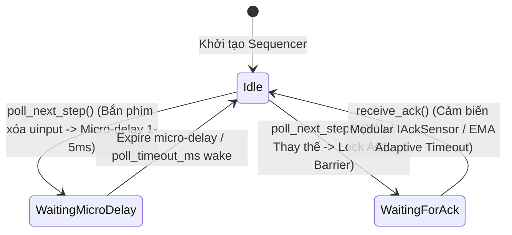

# MODULE: SEQUENCER LAYER (`src/sequencer/` & `fcitx5-lilypad/src/`)

@status: STABLE (v2.2.0-modular-sensor) | @last_update: 2026-08-06

> **Ghi chú Kiến trúc:** AT-SPI2 DOM ACK Engine đã được thử nghiệm và **GỠ BỎ HOÀN TOÀN** (xem chi tiết tại [archive/deprecated-decisions.md](file:///home/chiconcota/Documents/vnlilypad-lotus/.fcitx5-lilypad-ai/2-memory/archive/deprecated-decisions.md)). Hệ thống hiện sử dụng **Modular IAckSensor Architecture** (`NiriAckSensor` với EMA Adaptive Control & `GenericAckSensor` Fallback) kết hợp **Pure Kernel Uinput Backspace Sequencer**.

---

## 1. TỔNG QUAN VÀ VAI TRÒ KẾT NỐI (OVERVIEW)

**Sequencer Layer** (`lilypad-sequencer.h/.cpp` / `ImeEventQueue`) là Trái tim Điều phối Sự kiện của dự án **`fcitx5-lilypad`** (`vnlilypad-lotus`). Module này chịu trách nhiệm quản lý luồng sự kiện gõ giữa Compositor (Niri / Wayland / X11), Ứng dụng (Chrome, AFFiNE, VS Code, Terminal) và Engine xử lý Tiếng Việt (Bamboo Telex/VNI).

> **Nhiệm vụ cốt lõi:** Triệt tiêu $100\%$ hiện tượng đè phím, lặp từ `mminimln`, đảo chữ `choa` và trôi con trỏ bằng cách duy trì Hàng đợi Tuần tự Vi bước **Micro-Step State Machine**, kết hợp **Serial ID Tagging**, **Modular IAckSensor Barrier**, và **Universal ReplayBufferedKeys Protocol**.

---

## 2. KIẾN TRÚC MÁY TRẠNG THÁI MICRO-STEP (MICRO-STEP STATE MACHINE)

### Chi tiết các Trạng thái (`BarrierState`):
- **`Idle`**: Hàng đợi sẵn sàng. Khi nhận action mới từ Engine, `poll_next_step()` sẽ pop `MicroStep` tiếp theo ra dispatch.
- **`WaitingMicroDelay`**: Tạm dừng $1 \sim 5\,\text{ms}$ sau khi phát phím xóa `KEY_BACKSPACE` để Compositor & App render sạch phím xóa trước khi chèn chữ mới.
- **`WaitingForAck`**: Rào chắn bị khóa chờ tín hiệu `receive_ack()` từ Cảm biến `IAckSensor` (hoặc Safety Timeout trần 250ms tự động xả).

---

## 3. CHIẾN LƯỢC ĐIỀU PHỐI ADAPTIVE (MODULAR ACK SENSOR ARCHITECTURE)

> **Tài liệu Kỹ thuật Chi tiết:** Xem giải thích toán học EMA và Hướng dẫn đóng góp Sensor mới tại [niri-ack-sensor-architecture.md](file:///home/chiconcota/Documents/vnlilypad-lotus/.fcitx5-lilypad-ai/3-modules/sequencer-layer/niri-ack-sensor-architecture.md).

| Môi trường Compositor / App | Giao thức Cảm biến (`IAckSensor`) | Cơ chế Điều phối Sequencer | Đặc tính Hiệu năng |
| :--- | :--- | :--- | :--- |
| **Niri Compositor (Wayland)** | `NiriAckSensor` (EMA Machine Learning Adaptive Control) | Tự động đo thời gian phản hồi từng phím gõ thô ($0.35 \times \text{Measured} + 0.65 \times \text{Prev}$), tự điều chỉnh độ trễ thích ứng theo nhịp lag của App. | Tự suy giảm trễ (decay) nhanh về $5\text{ms}$ khi App mượt, phản hồi cực nhạy. |
| **Generic Wayland / Hyprland / Sway / KDE / GNOME** | `GenericAckSensor` (Fallback Adaptive Sensor) | Điều phối qua màng ngắt nhịp vi mô (micro-delay) kết hợp rào chắn ACK thích ứng chung. | Đảm bảo an toàn $100\%$ không bị đè chữ hay kẹt phím trên mọi distro. |
| **Terminal Emulators (Foot / Alacritty / Kitty)** | Batch Replay & Backspace Passthrough Protocol | Phân biệt phím `Space` (hoãn 3ms chống đè IPC) và phím thường (`a, b, c...` - xả tức thì 0.1ms). | Triệt tiêu $100\%$ lỗi xé lẻ gói tin và lặp rác chữ trên Terminal. |

---

## 4. BẢNG THÔNG SỐ VÀ CẤU TRÚC DỮ LIỆU (API REFERENCE)

### `lilypad-sequencer.h` (C++ Sequencer Interface)
- `push_step(MicroStep step)`: Thêm vi bước vào hàng đợi với `serial` tăng dần nguyên tử.
- `poll_next_step()`: Lấy vi bước tiếp theo nếu rào chắn ngắt nhịp/ACK đang mở.
- `receive_ack()`: Giải phóng rào chắn ACK khi cảm biến `IAckSensor` nhận tín hiệu đồng bộ, tự động tính toán adaptive delay.
- `stale_step_pruning()`: Lọc bỏ các vi bước cũ (`step.serial < active_serial_`) chống kẹt hàng đợi.

---

## 5. BẢO VỆ AN TOÀN (FREEZE SAFETY GUARD)
- Nâng Safety Timeout trần lên **250ms** trong `lilypad-sequencer.cpp/.h`. Nếu ứng dụng bị đóng băng hoặc lag nặng quá 250ms, Sequencer sẽ tự động xả rào chắn để tránh treo phím bàn phím người dùng.
