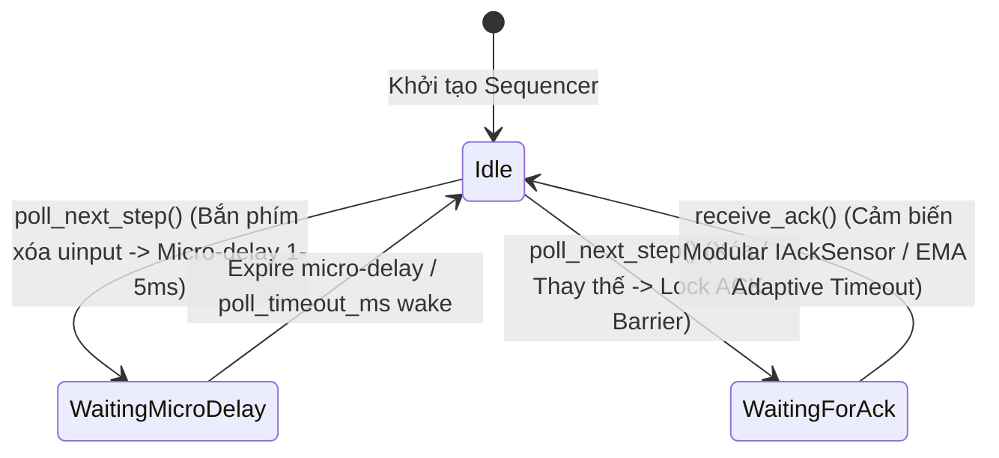

# MODULE: SEQUENCER LAYER (`src/sequencer/` & `fcitx5-lilypad/src/`)

@status: STABLE (v2.3.0-iki-adaptive) | @last_update: 2026-08-25

> **Ghi chú Kiến trúc:** Hệ thống sử dụng **Kiến trúc Cảm biến Vòng lặp Kép (Dual-Sensor Control Loop)**:
> 1. **`IAckSensor` (Cảm biến Đường truyền & Micro-Pacing):** Đo độ trễ vòng lặp Compositor/App roundtrip và tính toán độ trễ vi mô thích ứng `get_micro_delay_us(bsCount, iki_ms)` qua `fcitx5-lilypad/src/ack-sensors/`.
> 2. **`IIkiSensor` (Cảm biến Ngón tay):** Đo nhịp gõ thời gian thực ($\Delta t$) ngón tay người dùng và tính EMA IKI qua `fcitx5-lilypad/src/iki-sensors/`. Nén độ trễ ngắt nhịp xuống $1.0\text{ms} \sim 2.5\text{ms}$ khi gõ lướt Burst Typing.

---

## 1. TỔNG QUAN VÀ VAI TRÒ KẾT NỐI (OVERVIEW)

**Sequencer Layer** (`lilypad-sequencer.h/.cpp` / `ImeEventQueue`) là Trái tim Điều phối Sự kiện của dự án **`fcitx5-lilypad`** (`vnlilypad-lotus`). Module này chịu trách nhiệm quản lý luồng sự kiện gõ giữa Compositor (Niri / Wayland / X11), Ứng dụng (Chrome, AFFiNE, VS Code, Terminal) và Engine xử lý Tiếng Việt (Bamboo Telex/VNI).

> **Nhiệm vụ cốt lõi:** Triệt tiêu $100\%$ hiện tượng đè phím, lặp từ `mminimln`, đảo chữ `choa` và trôi con trỏ bằng cách duy trì Hàng đợi Tuần tự Vi bước **Micro-Step State Machine**, kết hợp **Serial ID Tagging**, **Modular IAckSensor & IIkiSensor Dual-Loop Barrier**, và **Optimized Batch Replay Protocol**.

---

## 2. KIẾN TRÚC MÁY TRẠNG THÁI MICRO-STEP (MICRO-STEP STATE MACHINE)



### Chi tiết các Trạng thái (`BarrierState`):
- **`Ready` (Idle)**: Hàng đợi sẵn sàng. Khi nhận action mới từ Engine, `poll_next_step()` sẽ pop `MicroStep` tiếp theo ra dispatch.
- **`WaitingMicroDelay`**: Tạm dừng $1.0 \sim 5.0\,\text{ms}$ (co giãn theo IKI Fast-Path) sau khi phát phím xóa `KEY_BACKSPACE` để Compositor & App render sạch phím xóa trước khi chèn chữ mới.
- **`WaitingForAck`**: Rào chắn bị khóa chờ tín hiệu `receive_ack()` từ Cảm biến `IAckSensor`.
- **`AppLagHolding`**: Tự động kích hoạt khi chạm Soft Timeout ($T_{\text{elapsed}} \ge T_{\text{soft}}$), tạm ngừng bắn uinput tiếp theo và gom phím an toàn vào RAM `buffered_keys_` chờ App bắt kịp.

---

## 3. CHIẾN LƯỢC ĐIỀU PHỐI ADAPTIVE & TWO-TIER TIMEOUT (PHASE 4.3)

> **Tài liệu Kỹ thuật Chi tiết:** Xem giải thích toán học EMA và Hướng dẫn đóng góp Sensor mới tại [niri-ack-sensor-architecture.md](file:///home/chiconcota/Documents/vnlilypad-lotus/.fcitx5-lilypad-ai/3-modules/sequencer-layer/niri-ack-sensor-architecture.md) và [iki-adaptive-architecture.md](file:///home/chiconcota/Documents/vnlilypad-lotus/.fcitx5-lilypad-ai/3-modules/sequencer-layer/iki-adaptive-architecture.md).

```text
┌────────────────────────────────────────────────────────────────────────┐
│                   HỆ THỐNG TIMEOUT 2 TẦNG (TWO-TIER)                   │
│                                                                        │
│  1. Baseline kỳ vọng: T_expected = micro_delay + EMA_App_ACK           │
│  2. Soft Timeout (Dynamic App Lag): T_soft = clamp(max(2.0*T_exp,      │
│                                    min(IKI, T_exp+30)), 35ms, 120ms)   │
│     -> AppLagHolding: Giữ phím RAM, chống rách chữ tiếng Việt.         │
│  3. Hard Timeout (Watchdog 250ms): Cắt lỗ khẩn cấp purgeContextEmergency│
│     -> Reset Bamboo Engine, Word Buffer và xả phím thô an toàn.        │
└────────────────────────────────────────────────────────────────────────┘
```

| Môi trường Compositor / App | Giao thức Cảm biến (`IAckSensor`) | Cơ chế Điều phối Sequencer | Đặc tính Hiệu năng |
| :--- | :--- | :--- | :--- |
| **Niri Compositor (Wayland)** | `NiriAckSensor` (EMA Machine Learning + N+1 Sentinel Barrier + App ACK Consumption) | Phát $N+1$ phím Backspace từ uinput, nuốt phím $N+1$ làm Sentinel Barrier. Tích hợp công thức Lerp động: $\Delta t = \text{lerp}(1\text{ms}, 15\text{ms}, t) + N \cdot \max(\text{lerp}(0.5\text{ms}, 18\text{ms}, t), T_{\text{ack}})$. | Tức thì $2.5\text{ms} \sim 3.0\text{ms}$ trên Terminal, giữ trần $>50\text{ms}$ an toàn tuyệt đối cho Facebook / Web DOM. Cold Start $>50\text{ms}$ cho chữ đầu tiên. |
| **Generic Wayland / Hyprland / Sway / KDE / GNOME** | `GenericAckSensor` (Fallback Adaptive Sensor) | Điều phối qua màng ngắt nhịp vi mô kết hợp rào chắn Sentinel $N+1$ và công thức Lerp thích ứng chung. | Đảm bảo an toàn $100\%$ không bị đè chữ, nuốt đuôi từ hay kẹt phím trên mọi distro. |
| **Terminal Emulators (Foot / Alacritty / Kitty)** | Batch Replay & Backspace Passthrough Protocol | Phân biệt phím `Space` (hoãn 3ms chống đè IPC) và phím thường (`a, b, c...` - xả tức thì 0.3ms). | Triệt tiêu $100\%$ lỗi xé lẻ gói tin và lặp rác chữ trên Terminal. |

---

## 4. BẢNG THÔNG SỐ VÀ CẤU TRÚC DỮ LIỆU (API REFERENCE)

### `lilypad-sequencer.h` (C++ Sequencer Interface)
- `push_step(MicroStep step)`: Thêm vi bước vào hàng đợi với `serial` tăng dần nguyên tử.
- `poll_next_step()`: Lấy vi bước tiếp theo nếu rào chắn ngắt nhịp/ACK đang mở.
- `receive_ack()`: Giải phóng rào chắn ACK khi cảm biến `IAckSensor` nhận tín hiệu đồng bộ, tự động tính toán adaptive delay.
- `calculate_soft_timeout_ms(iki_ms)`: Tính toán ngưỡng Soft Timeout động theo nhịp ngón tay và độ trễ App.
- `is_soft_timeout(iki_ms)` / `is_hard_timeout()`: Kiểm tra trạng thái quá hạn của giao dịch hiện tại.
- `stale_step_pruning()`: Lọc bỏ các vi bước cũ (`step.serial < active_serial_`) chống kẹt hàng đợi.

---

## 5. BẢO VỆ AN TOÀN & APTOMAT KHẨN CẤP (WATCHDOG 250MS SAFETY GUARD)
- **Watchdog Timer 250ms:** Main Event Loop cài đặt timer 250ms mỗi khi bắt đầu `performReplacement()`, tự động hủy khi commit thành công.
- **Hàm `purgeContextEmergency()`:** Nếu xảy ra freeze/lag quá 250ms, hệ thống lập tức cắt lỗ trạng thái, reset Engine và xả phím thô trong RAM, đảm bảo bàn phím không bao giờ bị đơ.
