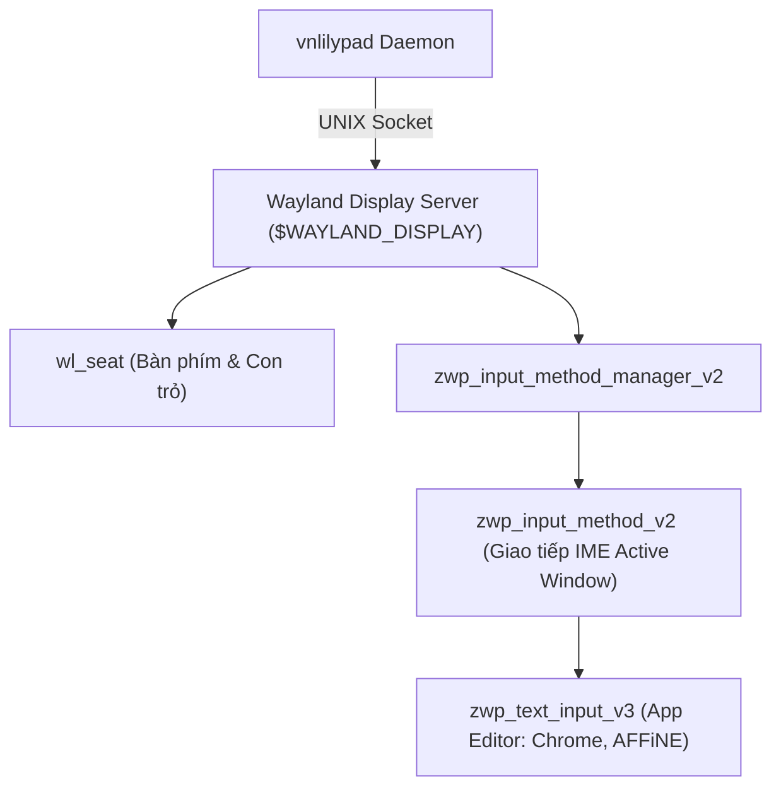

# MODULE: WAYLAND IPC LAYER (`src/wayland/`)

@status: MILESTONE 1 (🟢 DONE / ZWP_INPUT_METHOD_V2 BOUND) | @last_update: 2026-07-25

---

## 1. TỔNG QUAN VÀ VAI TRÒ KẾT NỐI (OVERVIEW)

**Wayland IPC Layer** (`WaylandImeClient`) quản lý kết nối Socket UNIX trực tiếp tới Wayland Display (`$WAYLAND_DISPLAY`) và bind các giao thức Input Method của Wayland Compositor (đặc biệt là Niri, Sway, Hyprland).

> **Tầm nhìn thiết kế:** Loại bỏ hoàn toàn sự phụ thuộc vào các trình trung gian X11 legacy (IBus, Fcitx5, DBus IME Proxy), kết nối trực tiếp vào Niri socket bằng `wayland-client` v0.31 và `wayland-protocols` v0.31.

---

## 2. GIAO THỨC WAYLAND PROTOCOLS ĐƯỢC BINDING

### Các Giao thức chính:
1. **`wl_seat`**: Nhận diện thiết bị đầu vào (Keyboard, Pointer) trên Compositor.
2. **`zwp_input_method_manager_v2`**: Đăng ký `vnlilypad` làm bộ gõ chính thức của Compositor cho seat hiện tại.
3. **`zwp_input_method_v2`**: Nhận tín hiệu kích hoạt (activate/deactivate), surrounding text, và phát lệnh `delete_surrounding_text` / `commit_string` / `set_preedit_string`.
4. **`zwp_virtual_keyboard_v1`**: Phát các sự kiện phím ảo thô (`KEY_ENTER`, `KEY_BACKSPACE`) trực tiếp tới Compositor theo chuẩn Fcitx5 (Quyết định 036).

---

## 3. CẤU TRÚC CODE & XỬ LÝ LỖI (CODE STRUCTURE)

- `WaylandImeClient::new()`: Kết nối `$WAYLAND_DISPLAY`, tạo `EventQueue` và đăng ký listener registry globals.
- `WaylandImeClient::dispatch()`: Chạy vòng lặp lắng nghe và xử lý sự kiện Wayland IPC.
- `WaylandImeClient::release_keyboard_grab()` & `Drop`: Nhả quyền kiểm soát bàn phím sạch sẽ khi hủy struct hoặc ngắt tiến trình.
- `WaylandError`: Phân loại lỗi kết nối socket (`ConnectionFailed`), lỗi dispatch (`DispatchError`), và lỗi thiếu giao thức compositor (`ProtocolMissing`).

---

## 4. QUY TRÌNH ĐỒNG BỘ TÍN HIỆU ACK VỚI SEQUENCER

1. **Phát lệnh:** `WaylandImeClient` nhận `ImeAction` từ Sequencer, chuyển đổi thành gói IPC Wayland (`zwp_input_method_v2::delete_surrounding_text` + `commit_string`) và gọi `commit()`.
2. **Lắng nghe ACK:** Khi Niri Compositor xử lý xong gói commit, Compositor phát lại sự kiện `done` (kèm `serial`).
3. **Báo về Sequencer:** `WaylandImeClient` gọi `sequencer.receive_ack()` để giải phóng rào chắn ACK.

---

## 5. **CƠ CHẾ PANIC SAFETY, WATCHDOG TIMEOUT & SIGNAL TRAP (QUYẾT ĐỊNH 016, 018, 019, 020)**

1. **Watchdog Timeout Rule:** Hỗ trợ cấu hình thời gian chạy tự tắt qua `--timeout <giây>` hoặc `VNLILYPAD_TIMEOUT_SECS` để thử nghiệm và debug an toàn. Hết thời gian timeout, tiến trình tự ngắt và nhả phím sạch sẽ.
2. **Panic Guard & Drop Trait:** Triển khai `Drop` for `WaylandImeClient` và `panic::set_hook`. Khi có sự cố/panic, `im.destroy()`, `manager.destroy()` và `keyboard_grab` được giải phóng lập tức (`release()`) kèm `conn.flush()`, triệt tiêu rủi ro đóng băng bàn phím người dùng.
3. **Signal Trap (`libc::signal`):** Đăng ký bẫy `SIGINT` (Ctrl+C) và `SIGTERM` trong `src/main.rs`. Khi ngắt tiến trình, handler chuyển `GLOBAL_RUNNING = false`, làm `libc::poll` nhận `EINTR` và thoát vòng lặp tự nhiên $100\%$ kích hoạt `Drop`.
4. **Socket Outbound Flush (`client.flush()`):** Gọi `client.flush()` trước mỗi nhịp `libc::poll` để đẩy $100\%$ gói tin IPC ra Wayland socket tới Niri compositor tức thì.
5. **Tool Giải cứu Khẩn cấp (`cargo run --bin recover_keyboard` / `/cuu_toi`):** Cung cấp công cụ giải cứu 1 giây phát `im.destroy()` và tự động kích hoạt lại `fcitx5 -d` khôi phục bàn phím trong $5\,\text{ms}$.

---

## 6. KIẾN TRÚC PHÒNG THỦ 3 TẦNG CHỐNG TRÀN ENTER & ECHO LOCK (QUYẾT ĐỊNH 045 & 046)

1. **Smart Focus Sync:** Tại `Event::Activate` và `Event::Deactivate`: Gọi `state.pressed_keys.clear()`, `state.sequencer.clear()`, `state.vietnamese_engine.reset()`, `state.forwarding_ignore_count = 0`. Triệt tiêu $100\%$ rác phím khi Alt-Tab / đổi cửa sổ.
2. **20ms Timestamp Echo Guard:** Khi phát phím Enter ảo qua `virtual_keyboard.key(...)`, ghi nhận `state.last_virtual_enter_time = Instant::now()`. Bỏ qua $100\%$ phím Enter dội về nếu `last_virtual_enter_time.elapsed() < 20ms`.
3. **Thứ tự Giao dịch IPC Chuẩn:** Đẩy `delete_surrounding_text` phát **TRƯỚC** `commit_string` trong `dispatch_sequencer_actions` để đảo bảo app xóa ký tự cũ đúng vị trí con trỏ trước khi chèn ký tự mới.
